# Table of Contents

* [设计模式](#设计模式)
  * [工厂方法](#工厂方法)
    * [概念](#概念)
    * [适用场景](#适用场景)
    * [优点](#优点)
    * [缺点](#缺点)
    * [coding](#coding)
    * [工厂方法在源码中的体现](#工厂方法在源码中的体现)
  * [抽象工厂](#抽象工厂)
    * [概念](#概念-1)
    * [适用场景](#适用场景-1)
    * [优点](#优点-1)
    * [缺点](#缺点-1)
    * [coding](#coding-1)
  * [对比工厂方法和抽象工厂](#对比工厂方法和抽象工厂)
  * [外观模式](#外观模式)
    * [概念](#概念-2)
    * [适用场景](#适用场景-2)
    * [优点](#优点-2)
    * [缺点](#缺点-2)
    * [coding](#coding-2)
  * [原型模式](#原型模式)
    * [概念](#概念-3)
    * [适用场景](#适用场景-3)
    * [优点](#优点-3)
    * [缺点](#缺点-3)
  * [装饰者模式](#装饰者模式)
    * [概念](#概念-4)
    * [适用场景](#适用场景-4)
    * [优点](#优点-4)
    * [缺点](#缺点-4)
    * [装饰者-相关设计模式](#装饰者-相关设计模式)
    * [coding](#coding-3)
  * [适配器模式](#适配器模式)
    * [概念](#概念-5)
    * [适用场景](#适用场景-5)
    * [优点](#优点-5)
    * [缺点](#缺点-5)
    * [coding](#coding-4)
  * [享元模式](#享元模式)
    * [概念](#概念-6)
    * [适用场景](#适用场景-6)
    * [优点](#优点-6)
    * [缺点](#缺点-6)
  * [组合模式](#组合模式)
    * [概念](#概念-7)
    * [适用场景](#适用场景-7)
    * [优点](#优点-7)
    * [缺点](#缺点-7)
    * [coding](#coding-5)
  * [桥接模式](#桥接模式)
    * [概念](#概念-8)
    * [适用场景](#适用场景-8)
    * [优点](#优点-8)
    * [缺点](#缺点-8)

# 设计模式
## 工厂方法
### 概念
* 定义: 定义一个创建对象的接口, 但让实现这个接口的类来决定实例化哪个类, 工厂方法让类的实例化推迟到子类中进行
* 类型: 创建型
### 适用场景
1. 创建对象需要大量重复的代码
2. 客户端(应用层)不依赖于产品类实例如何被创建、实现等细节
3. 一个类通过其子类来指定创建哪个对象
### 优点
* 用户只需要关心所需产品对应的工厂, 无需关心细节
* 加入新的产品符合开闭原则, 提高可扩展性
### 缺点
* 类的个数容易过多, 增加复杂度
* 增加了系统的抽象性和理解难度
### coding

* 抽象工厂默认使用抽象类而不是使用接口, 只定义规范契约而不决定产生哪一类的产品, 产生哪一种类型完全交由子类实现
* 原因: 大多数情况下抽象工厂有些行为是已知的, 所以抽象类可以提供默认已知的方法实现; 只有在有些工厂是无法描述的时候使用接口做为抽象工厂
### 工厂方法在源码中的体现
 
* 抽象产品是Iterator, 实际产品是Itr
* 抽象工厂是Iterable, 实际工厂是ArrayList
## 抽象工厂

### 概念
* 定义: 抽象工厂模式提供一个创建一系列相关或互相依赖的对象的接口
* 无需指定它们具体的类
* 类型: 创建型
### 适用场景
1. 客户端(应用层)不依赖于产品类实例如何被创建、实现等细节
2. 强调一系列相关的产品对象(属于同一产品族), 一起使用创建对象时需要大量重复的代码
### 优点
* 用户只需要关心所需产品对应的工厂, 无需关心细节
* 将一个系列的产品族统一到一起创建
### 缺点
* 规定了所有可能被创建的产品集合, 产品族中扩展新的产品困难, 需要修改抽象工厂的接口
* 增加了系统的抽象性和理解难度
### coding

* 使用时只需要关心实体是哪个产品族工厂, 调用对应的产品创建方法
* 总结: **扩展产品族容易, 新增产品等级困难(接口需要更改)**, 适用于产品等级相对固定的场景 
## 对比工厂方法和抽象工厂
* 设计维度不同: **工厂方法**对**产品等级**易于扩展, **抽象工厂**对**产品族**易于扩展
* **面试题: 工厂方法和抽象工厂的区别?**
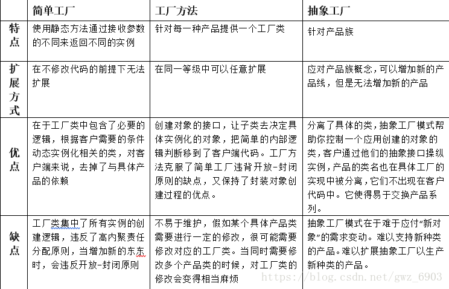
> 答: 1.工厂方法是针对每一种产品提供一个工厂, 而抽象工厂是针对产品族提供一个工厂(一个工厂可以不同产品但是是同一个品牌).
2.工厂方法在同一等级中可以任意扩展, 抽象工厂应对产品族概念, 可以增加新的产品线, 但无法增加新的产品

## 外观模式
### 概念
* 定义: 又叫门面模式, 提供了一个统一的接口, 用来访问子系统中的一群接口
* 外观模式定义了一个高层接口, 让子系统更容易使用
* 类型: 结构型
### 适用场景
1. 子系统越来越复杂, 增加外观模式提供简单调用接口
2. 构建多层系统结构, 利用外观对象作为每层的入口, 简化层间调用
### 优点
* 简化调用过程, 无需深入了解子系统, 防止带来风险
* 减少系统依赖、松散耦合
* 更好的划分访问的层次
* 符合迪米特法则, 即最少知道原则
### 缺点
* 增加子系统、扩展子系统行为容易引入风险
* 不符合开闭原则
### coding

积分支付系统, [示例](src/main/java/com/louye/design/structural/facade/Test.java)
## 原型模式
### 概念
* 定义: 指原型实例指定创建对象的的种类, 并且拷贝这些原型创建新的对象
* 不需要知道任何创建的细节, 不调用构造函数
* 类型: 创建型
### 适用场景
1. 类初始化消耗资源多
2. new产生一个对象需要非常繁琐的过程(数据准备、访问权限等)
3. 构造函数比较复杂
4. 循环体中生产大量的对象时
### 优点
* 原型模式比直接new一个对象性能高
* 简化创建过程
### 缺点
* 必须配备克隆方法
* 对克隆复杂对象或对克隆出的对象进行复杂改造时, 容易引入风险
* 深拷贝、浅拷贝要运用得当; [深浅拷贝分析](https://segmentfault.com/a/1190000010648514)

## 装饰者模式
### 概念
* 定义: 在不改变原有对象的基础上, 将功能附加到对象上
* 提供了比继承更有弹性的替代方案(**动态扩展原有对象功能**)
* 类型: 结构型
### 适用场景
1. 扩展一个类的功能或给一个类添加附加职责
2. 动态的给一个对象添加功能, 这些功能可以再动态的撤销
### 优点
* 继承的有力补充, 比继承灵活, 在不改变原有对象的情况下给一个对象扩展功能
* 通过使用不同的装饰类以及这些装饰类的排列组合, 可以实现不同效果
* 符合开闭原则
### 缺点
* 会出现更多的代码, 更多的类, 增加程序的复杂性
* 动态装饰时, 多层装饰时会使程序更复杂
### 装饰者-相关设计模式
* 装饰者模式和代理模式
* 装饰者模式和适配器模式
### coding

* 简单继承进行装饰, [示例](src/main/java/com/louye/design/structural/decorator/v1/Main.java)

* 使用抽象模板进行装饰, [示例](src/main/java/com/louye/design/structural/decorator/v2/Test.java)

## 适配器模式
### 概念
* 定义: 将一个类的接口转换成客户期望的另一个接口
* 使原本接口不兼容的类可以一起工作
* 类型: 结构型
### 适用场景
1. 已经存在的类, 它的方法和需求不匹配时(方法结果相同或相似)
2. 不是软件设计阶段考虑的设计模式, 是随着软件维护, 由于不同产品、不同厂家造成功能类似而接口不同的情况下的解决方案
### 优点
* 能提高类的透明性和复用, 现有的类复用但不需要改变
* 目标类和适配器类解耦, 提高程序的扩展性
* 符合开闭原则
### 缺点
* 适配器编写的过程需要全面考虑, 可能会增加系统的复杂性
* 增加系统代码可读的难度
### coding
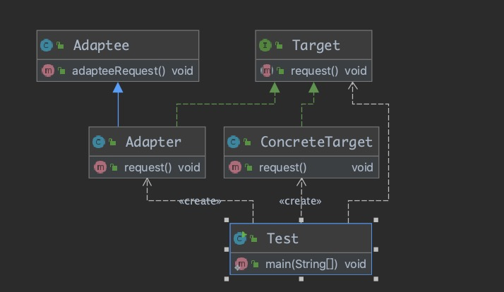
* 类适配器: 使用继承的方式进行适配, [示例](src/main/java/com/louye/design/structural/adapter/classadapter/Test.java)
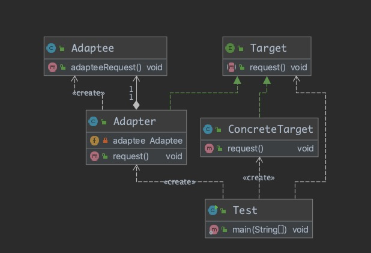
* 对象适配器: 使用组合的方式进行适配, [示例](src/main/java/com/louye/design/structural/adapter/objectadapter/Test.java)

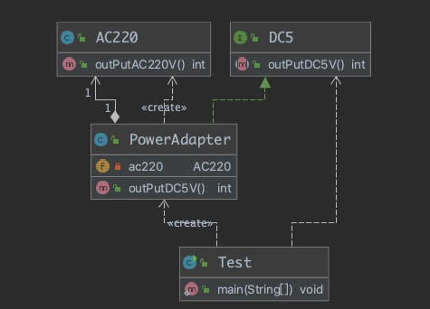
* 场景实例: 生活场景中的电源适配器,将200V电流转换成5V电流, [示例](src/main/java/com/louye/design/structural/adapter/Test.java)

## 享元模式
### 概念
* 定义: 提供了减少对象数量从而改善应用所需的对象结构的方式
* 运用共享技术有效地支持大量细粒度的对象
* 类型: 结构型
### 适用场景
1. 常常应用于系统底层的开发, 以便解决系统的性能问题(例如: Java中的String类型、数据库的连接池等)
2. 系统有大量的相似对象、需要缓冲池的场景
### 优点
* 减少对象的创建, 降低内存中对象的数量, 降低系统的内存, 提高效率
* 减少内存之外的其他资源占用
### 缺点
* 关注内/外部状态、关注线程安全问题
* 使系统、程序的逻辑复杂化

## 组合模式
### 概念
* 定义: 将对象组合成树形结构以表示"整体-部分"的层次结构
* 组合模式使单个对象和组合对象保持一致的方式处理
* 类型结构型
### 适用场景
1. 希望客户端可以忽略组合对象与单个对象的差异时
2. 处理一个树形结构时
### 优点
* 清楚的定义的层次的复杂对象, 表示对象的全部或部分层次
* 让客户端忽略层次的差异, 方便对整个层次进行控制
* 简化客户端代码
* 符合开闭原则
### 缺点
* 限制类型时会较为复杂
* 使设计变得更加抽象
### coding
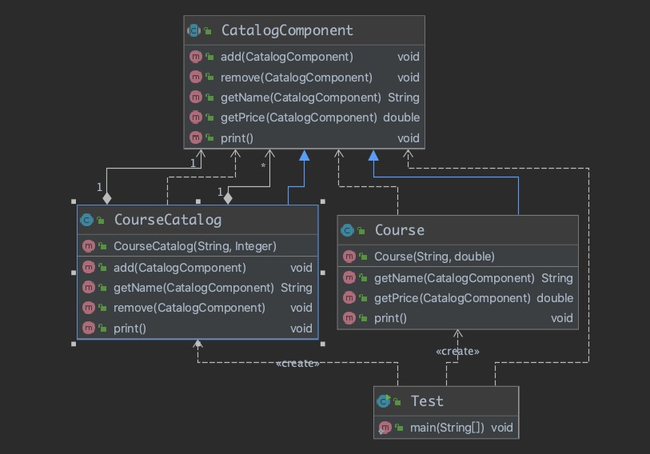
* 使用组合模式的时候最关键的一点: 叶子对象和组合对象都要使用相同的接口或者继承相同的抽象类, [示例](src/main/java/com/louye/design/structural/composite/Test.java)
## 桥接模式
### 概念
* 定义: 将抽象部分与它的实现部分分离, 使它们都可以独立的变化
* 通过组合关系建立两个类之前的联系, 而不是继承
* 类型: 结构型
### 适用场景
1. 抽象和具体实现之间增加更多的灵活性
2. 一个类存在两个或多个独立变化的维度, 并且这两个或多个维度都需要独立进行扩展
3. 不希望使用继承, 或者因为多层继承导致系统的类个数剧增
### 优点
* 分离抽象部分及其具体实现部分
* 提高了系统的可扩展性
* 符合开闭原则
### 缺点
* 增加了系统的理解和设计难度
* 需要正确的识别出系统中两个独立变化的维度

## 代理模式
### 概念
* 定义: 为其他对象提供一种代理, 以控制这个对象发的访问
* 代理对象在客户端和目标对象之间起到中介的作用
* 类型: 结构型
### 适用场景
1. 保护目标对象
2. 增强目标对象
### 优点
* 代理模式能将代理对象和真实被调用的目标对象分离
* 一定程度上降低了系统的耦合度, 扩展性好
* 保护目标对象
* 增强目标对象 
### 缺点
* 代理模式对造成系统设计中类的数目增加
* 在客户端和目标对象增加一个代理对象, 会造成请求速度变慢
* 增加了系统的复杂度
### 代理-扩展
* 静态代理
* 动态代理(只能对实现了接口的类进行动态代理)
* CGlib代理
### Spring代理选择-扩展
* 当Bean有实现接口时, Spring就会用JDK的动态代理
* 当Bean没有实现接口时, Spring就会用CGlib
* 当然也可以强制使用CGlib
### coding
#### 静态代理
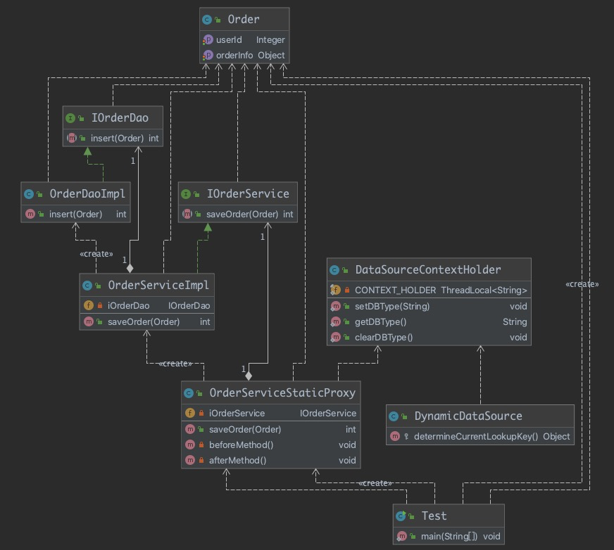
* [示例](src/main/java/com/louye/design/structural/proxy/staticproxy/Test.java)
### 动态代理
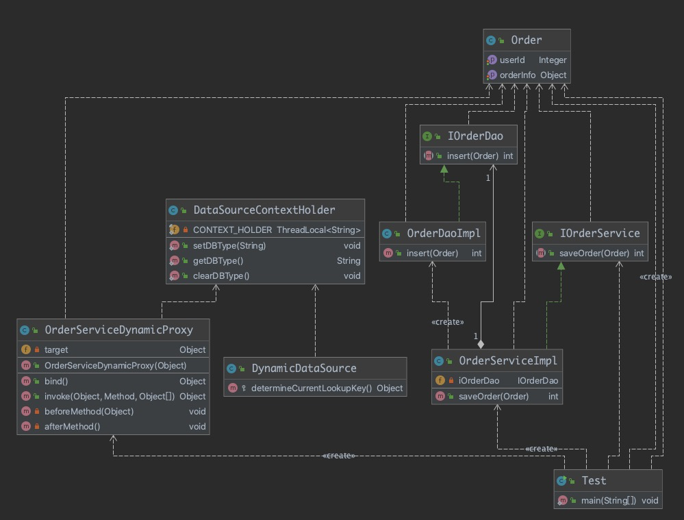
* [示例](src/main/java/com/louye/design/structural/proxy/dynamicproxy/Test.java)

## 模板方法模式
### 概念
* 定义: 定义了一个算法的骨架, 并允许子类为一个或多个步骤提供实现
* 模板方法使得子类可以在不改变算法结构的情况下, 重新定义算法的某些步骤 
* 类型: 行为型
### 适用场景
1. 一次性实现一个算法的不变的部分, 并将可变的行为留给子类来实现
2. 各子类中公共的行为被提取出来并集中到一个公共父类中, 从而避免代码重复
### 优点
* 提高复用性
* 提高扩展性
* 符合开闭原则
### 缺点
* 类数目的增加
* 增加了系统实现的复杂度
* 继承关系自身缺点, 如果父类添加新的抽象方法, 所有子类都要改一遍
### coding
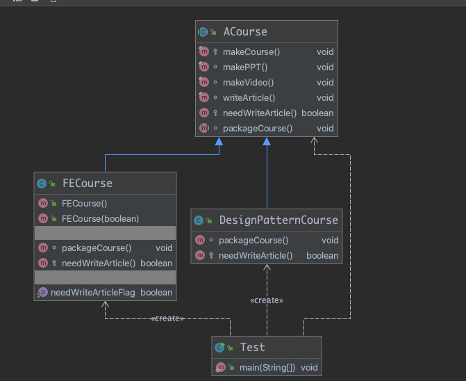
* [示例](sr 0c/main/java/com/louye/design/behavior/templatemethod/Test.java)
## 迭代器模式
### 概念
* 定义: 提供一种方法, 顺序访问一个集合中的各个元素, 而又不暴露对象的内部表示
* 类型: 行为型
### 适用场景
1. 访问一个集合对象的内容而无需暴露它的内部表示
2. 为遍历不同的集合结构提供一个统一的接口
### 优点
* 分离了集合对象的遍历行为
### 缺点
* 类的个数成对增加
### coding
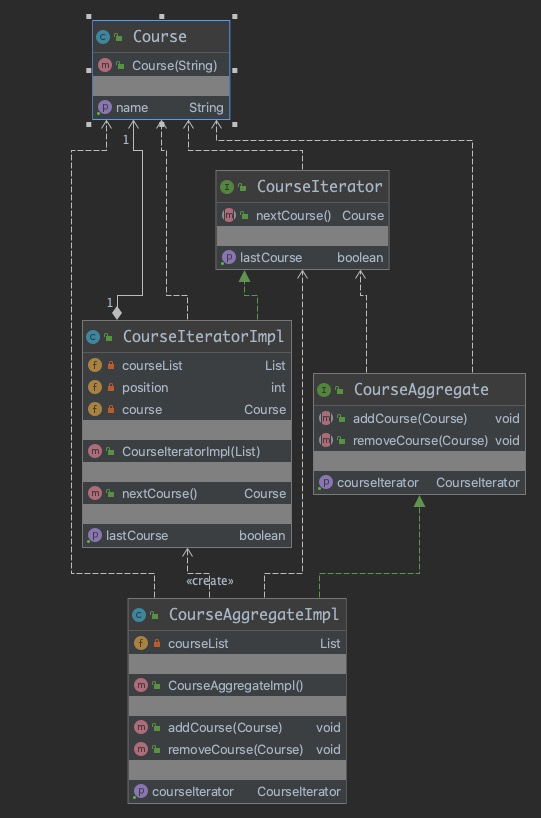
## 策略模式
### 概念
* 定义: 定义了算法家族, 分别封装起来, 让他们之间可以互相替换, 此模式让算法的变化不会影响到使用算法的用户.
类型: 行为型
### 适用场景
1. 系统有很多类, 而他们的区别仅仅在于他们的行为不同
2. 一个系统需要动态的在几种算法中进行选择一种
### coding
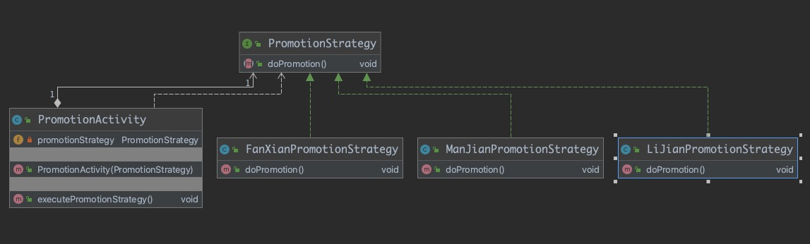
* [示例](src/main/java/com/louye/design/strategy/Test.java)
* 策略模式在JDK中的应用: Comparator比较器就是一个抽象的策略
#### 工厂模式和策略模式的整合
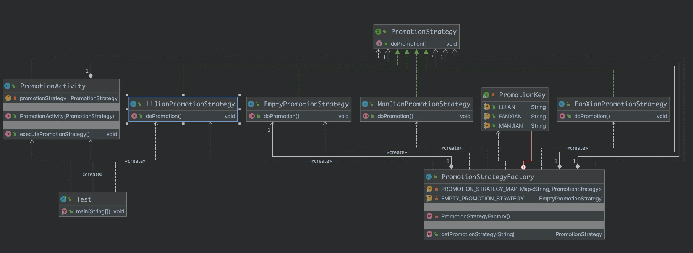
## 解释器模式
### 概念
* 定义: 给定一个语言, 定义它的文法的一种表示, 并定义一个解释器, 这个解释器使用该表示来解释语言中的句子
* 为了解释一种语言, 而为语言创建的解释器
* 类型: 行为型
### 适用场景
1. 某个特定类型问题发生频率足够高
### 优点
* 语法由很多类表示, 容易改变及扩展此"语言"
### 缺点
* 当语法规则数目太多时, 增加了系统复杂度
## 观察者模式
### 概念
* 定义: 定义了对象之间的一对多依赖, 让多个观察者对象同时监听某一个主题对象, 当主题对象发生变化时, 它的所有依赖者(观察者)都会收到通知并更新
* 举例: 
    1. 微信点赞后, 微信朋友圈就是被观察者, 点赞的就是观察者, 当别人评论时就会通知到点赞的观察者
    2. 商品被收藏或关注, 商品降价时会进行通知
* 类型: 行为型
### 适用场景
1. 关联行为场景, 建立一套触发机制
### 优点
* 观察者和被观察者之间建立一个抽象的耦合
* 观察者模式支持广播通信
### 缺点
* 观察者之间有过多的细节依赖, 提高时间消耗及程序复杂度
* 使用要得当, 避免循环调用
### coding
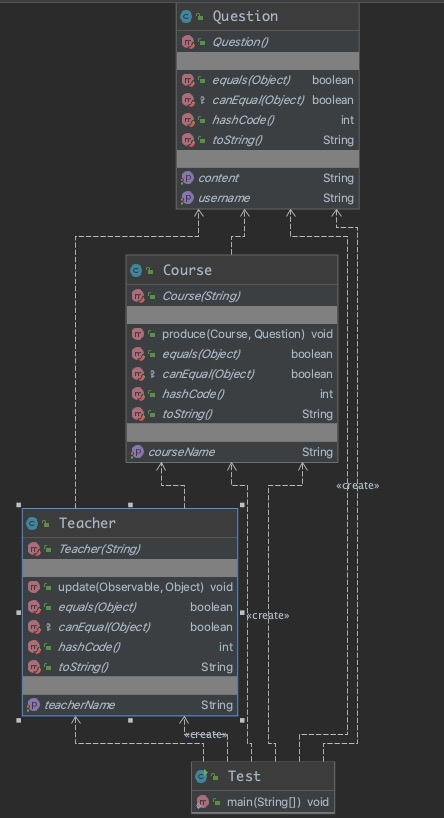
* [示例](src/main/java/com/louye/design/behavior/observer/Test.java)
## 备忘录模式
### 概念
* 定义: 保存一个对象的某个状态, 以便在适当的时候恢复对象
* "后悔药"
* 类型: 行为型
### 适用场景
1. 保存及恢复数据相关业务场景
2. 后悔的时候, 及想恢复到之前的状态
### 优点
* 为用户提供一种可恢复的机制
* 存档信息的一个封装
### 缺点
* 资源的占用
## 命令模式
### 概念
* 定义: 将"请求"封装成对象, 以便使用不同的请求
* 命令模式解决了应用程序中对象的职责以及他们之间的通信方式
### 适用场景
1. 请求的调用者和请求的接收者需要解耦, 使得调用者和接收者不直接交互
2. 需要抽象出等待执行的行为
### 优点
* 降低耦合
* 容易扩展新命令或者一组命令
### 缺点
* 命令的无线扩展会增加类的数量, 提高系统实现的复杂度
### coding
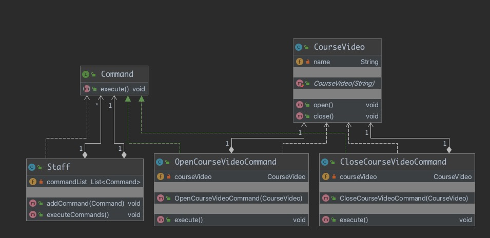
* 举例:员工执行多条命令, 命令命令类型有很多种, 员工只需要关注有多少条命令,
具体的命令类型、命令执行的内容和方式都不用关心.
* [示例](src/main/java/com/louye/design/behavior/command/Test.java)

