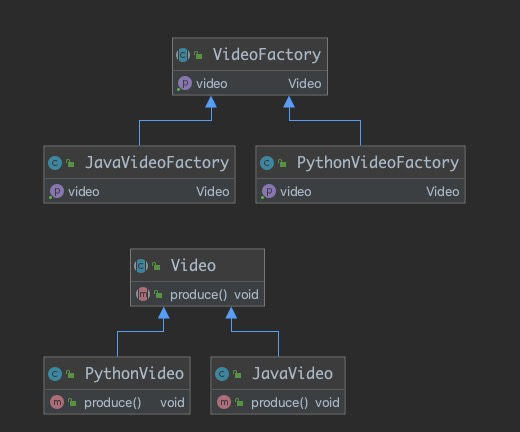
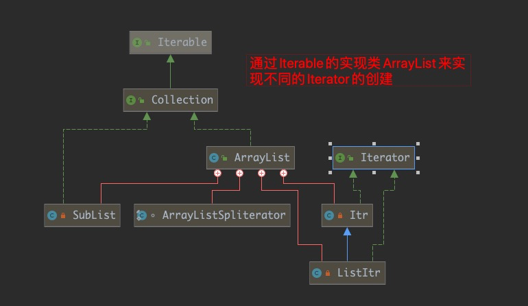
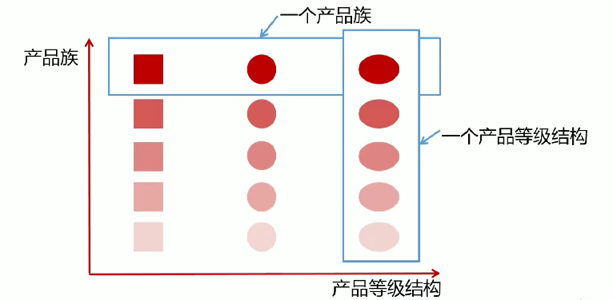
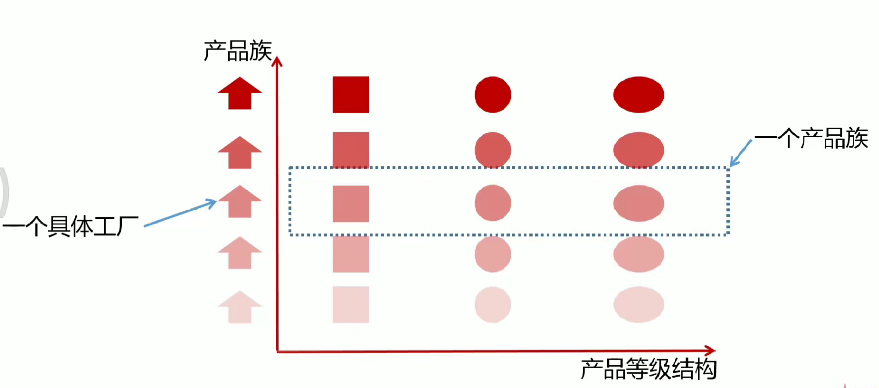
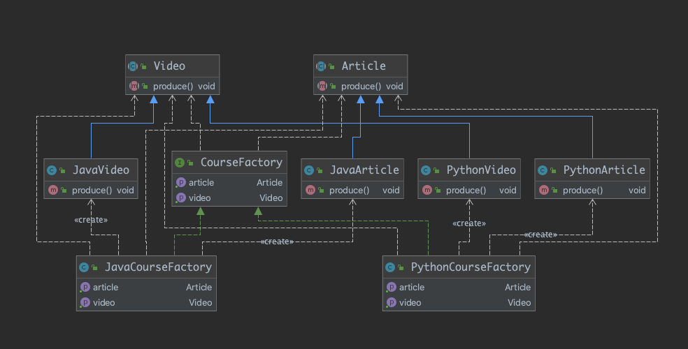
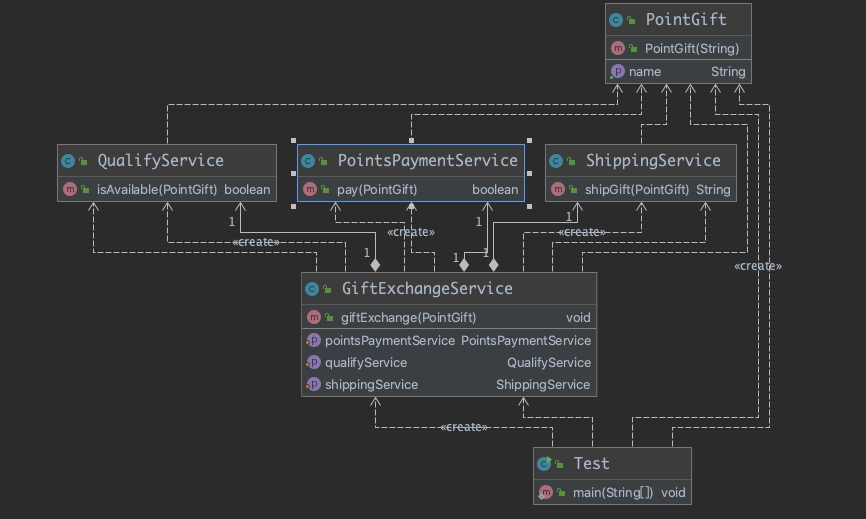
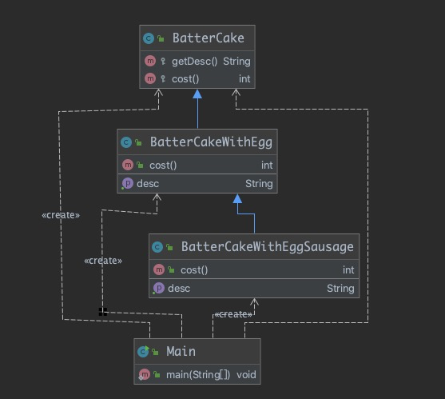
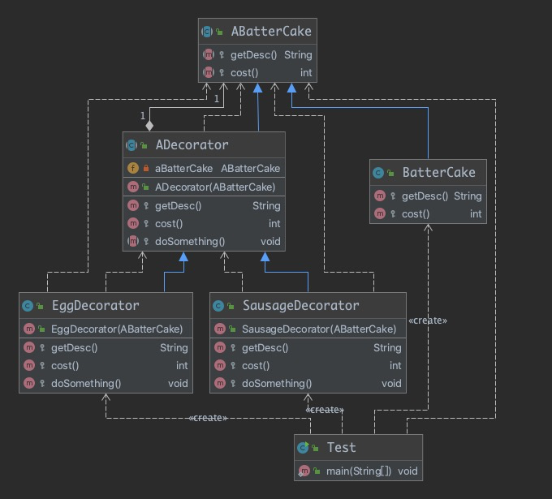

# 设计模式
## 工厂方法
### 概念
* 定义: 定义一个创建对象的接口, 但让实现这个接口的类来决定实例化哪个类, 工厂方法让类的实例化推迟到子类中进行
* 类型: 创建型
### 适用场景
1. 创建对象需要大量重复的代码
2. 客户端(应用层)不依赖于产品类实例如何被创建、实现等细节
3. 一个类通过其子类来指定创建哪个对象
### 优点
* 用户只需要关心所需产品对应的工厂, 无需关心细节
* 加入新的产品符合开闭原则, 提高可扩展性
### 缺点
* 类的个数容易过多, 增加复杂度
* 增加了系统的抽象性和理解难度
### coding

* 抽象工厂默认使用抽象类而不是使用接口, 只定义规范契约而不决定产生哪一类的产品, 产生哪一种类型完全交由子类实现
* 原因: 大多数情况下抽象工厂有些行为是已知的, 所以抽象类可以提供默认已知的方法实现; 只有在有些工厂是无法描述的时候使用接口做为抽象工厂
### 工厂方法在源码中的体现
 
* 抽象产品是Iterator, 实际产品是Itr
* 抽象工厂是Iterable, 实际工厂是ArrayList
## 抽象工厂

### 概念
* 定义: 抽象工厂模式提供一个创建一系列相关或互相依赖的对象的接口
* 无需指定它们具体的类
* 类型: 创建型
### 适用场景
1. 客户端(应用层)不依赖于产品类实例如何被创建、实现等细节
2. 强调一系列相关的产品对象(属于同一产品族), 一起使用创建对象时需要大量重复的代码
### 优点
* 用户只需要关心所需产品对应的工厂, 无需关心细节
* 将一个系列的产品族统一到一起创建
### 缺点
* 规定了所有可能被创建的产品集合, 产品族中扩展新的产品困难, 需要修改抽象工厂的接口
* 增加了系统的抽象性和理解难度
### coding

* 使用时只需要关心实体是哪个产品族工厂, 调用对应的产品创建方法
* 总结: **扩展产品族容易, 新增产品等级困难(接口需要更改)**, 适用于产品等级相对固定的场景 
## 对比工厂方法和抽象工厂
设计维度不同: **工厂方法**对**产品等级**易于扩展, **抽象工厂**对**产品族**易于扩展
## 外观模式
### 概念
* 定义: 又叫门面模式, 提供了一个统一的接口, 用来访问子系统中的一群接口
* 外观模式定义了一个高层接口, 让子系统更容易使用
* 类型: 结构型
### 适用场景
1. 子系统越来越复杂, 增加外观模式提供简单调用接口
2. 构建多层系统结构, 利用外观对象作为每层的入口, 简化层间调用
### 优点
* 简化调用过程, 无需深入了解子系统, 防止带来风险
* 减少系统依赖、松散耦合
* 更好的划分访问的层次
* 符合迪米特法则, 即最少知道原则
### 缺点
* 增加子系统、扩展子系统行为容易引入风险
* 不符合开闭原则
### coding

积分支付系统, [示例](src/main/java/com/louye/design/structural/facade/Test.java)
## 原型模式
### 概念
* 定义: 指原型实例指定创建对象的的种类, 并且拷贝这些原型创建新的对象
* 不需要知道任何创建的细节, 不调用构造函数
* 类型: 创建型
### 适用场景
1. 类初始化消耗资源多
2. new产生一个对象需要非常繁琐的过程(数据准备、访问权限等)
3. 构造函数比较复杂
4. 循环体中生产大量的对象时
### 优点
* 原型模式比直接new一个对象性能高
* 简化创建过程
### 缺点
* 必须配备克隆方法
* 对克隆复杂对象或对克隆出的对象进行复杂改造时, 容易引入风险
* 深拷贝、浅拷贝要运用得当; [深浅拷贝分析](https://segmentfault.com/a/1190000010648514)

## 装饰者模式
### 概念
* 定义: 在不改变原有对象的基础上, 将功能附加到对象上
* 提供了比继承更有弹性的替代方案(**动态扩展原有对象功能**)
* 类型: 结构型
### 适用场景
1. 扩展一个类的功能或给一个类添加附加职责
2. 动态的给一个对象添加功能, 这些功能可以再动态的撤销
### 优点
* 继承的有力补充, 比继承灵活, 在不改变原有对象的情况下给一个对象扩展功能
* 通过使用不同的装饰类以及这些装饰类的排列组合, 可以实现不同效果
* 符合开闭原则
### 缺点
* 会出现更多的代码, 更多的类, 增加程序的复杂性
* 动态装饰时, 多层装饰时会使程序更复杂
### 装饰者-相关设计模式
* 装饰者模式和代理模式
* 装饰者模式和适配器模式
### coding

* 简单继承进行装饰, [示例](src/main/java/com/louye/design/structural/decorator/v1/Main.java)

* 使用抽象模板进行装饰, [示例](src/main/java/com/louye/design/structural/decorator/v2/Test.java)

## 适配器模式
### 概念
* 定义: 将一个类的接口转换成客户期望的另一个接口
* 使原本接口不兼容的类可以一起工作
* 类型: 结构型
### 应用场景
1. 已经存在的类, 它的方法和需求不匹配时(方法结果相同或相似)
2. 不是软件设计阶段考虑的设计模式, 是随着软件维护, 由于不同产品、不同厂家造成功能类似而接口不同的情况下的解决方案
### 优点
* 能提高类的透明性和复用, 现有的类复用但不需要改变
* 目标类和适配器类解耦, 提高程序的扩展性
* 符合开闭原则
### 缺点
* 适配器编写的过程需要全面考虑, 可能会增加系统的复杂性
* 增加系统代码可读的难度